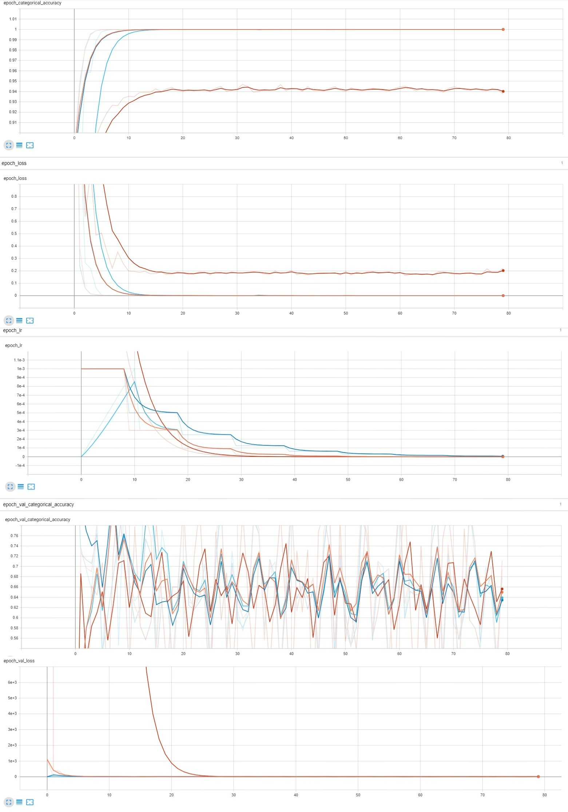

# lab5
## Step decay

На графиках ниже представлены:
Оранжевый - initial_lr = 0.001, drop = 0.3; Синий - initial_lr = 0.001, drop = 0.5; Красный -  initial_lr = 0.01, drop = 0.3; Голубой - Warm-Up 10 эпох, lr с 0.001 до 0.01, drop = 0.3.
Как видим по обучающей выборке, сильно выделяется красный: сошёлся хуже остальных, при этом имеет самый нестабильный характер, в то время как остальные три сошлись по точности уже к 10-15 эпохам и идут гладко. Оранжевый и синий ведут себя практически идентично, у красного же на валидационной выборке наблюдаются самые большие разбросы по точности, а сходимость по ошибке самая последняя. Оранжевый и синий сходятся в одно время как по ошибке, так и по точности на валидационной выборке, значит оптимальным вариантом будет явно с lr = 0.001, drop = 0.3/0.5.

## Exponential Decay

На графиках ниже представлены: 
